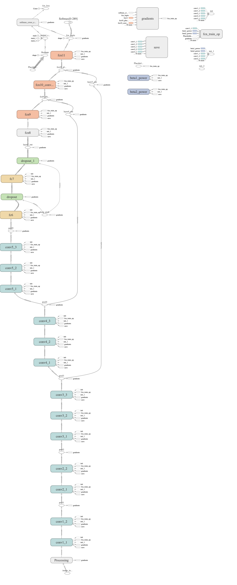

# Semantic Segmentation
### Introduction
In this project,I use a fully convolution network(FCN) to predicted the pixels of the road in images.

#### Network Architecture
This is a simple implementation of FCN-8


### Setup
##### Frameworks and Packages
Make sure you have the following is installed:
 Python 3,TensorFlow,NumPy,SciPy

You may also need [Python Image Library (PIL)](https://pillow.readthedocs.io/) for SciPy's `imresize` function.

##### Dataset
Download the [Kitti Road dataset](http://www.cvlibs.net/datasets/kitti/eval_road.php) from [here](http://www.cvlibs.net/download.php?file=data_road.zip).  Extract the dataset in the `data` folder.  This will create the folder `data_road` with all the training a test images.
<br>Or,you can just download the dataset by run the script
```bash
sh download_data.sh
```

### To run model
In the terminal, just run
```bash
python main.py
``` 

Or, you can modify the hyperparameters in the `run_model.sh` script,
and then run it
```bash
sh run_model.sh
```

